# Long-Term Weather Forecasting with Deep Learning


This project explores various deep learning architectures for long-term weather forecasting. Using a time-series dataset of weather metrics, several models—from a common-sense baseline to complex recurrent and convolutional networks—are built and evaluated to predict future temperature.

[](https://www.python.org/downloads/release/python-3110/)
[](https://www.tensorflow.org/)
[](https://keras.io/)

---

## File Structure

```
├── weather-long-term-time-series-forecasting.ipynb # The main Jupyter Notebook with all experiments
├── images # Images
├── requirements.txt # Requirements
├── LICENCE # Licence
└── README.md # You are here
```
---

## Table of Contents

- [File Structure](#file-structure)
- [Dataset](#dataset)
- [Methodology](#methodology)
- [Results](#results)
- [Conclusion](#conclusion)
- [Installation & Usage](#installation--usage)
- [Author](#author)

## Dataset

The project utilizes the **Weather Long-term Time Series Forecasting dataset**.

- **Source:** [Weather Long-Term Time Series Forecasting](https://www.kaggle.com/datasets/alistairking/weather-long-term-time-series-forecasting)
- **Content:** The dataset contains 21 features recorded every 10 minutes, including:
  - Temperature (`T`)
  - Atmospheric Pressure (`p`)
  - Relative Humidity (`rh`)
  - Wind direction (`wd`) and velocity (`wv`)
  - and other meteorological data.
- **Forecasting Goal:** The objective is to predict the temperature 24 hours into the future based on a sequence of past data.

## Methodology

### 1. Data Preparation

The raw time-series data is preprocessed to be suitable for training deep learning models.

1.  **Loading & Splitting:** The data is loaded into a pandas DataFrame and then split into training (50%), validation (25%), and testing (25%) sets.
2.  **Normalization:** The features are normalized by subtracting the mean and dividing by the standard deviation of the training data. This ensures all features are on a similar scale.
3.  **Time Series Windowing:** Using `keras.utils.timeseries_dataset_from_array`, the data is converted into windows of sequential data for the models.
    - `sequence_length`: Each input sample contains observations from the last 5 days (`sequence_length=120`, with one observation per hour).
    - `sampling_rate`: Data is sampled at one point per hour (`sampling_rate=6`, as the original data is every 10 minutes).
    - `delay`: The target for each sequence is the temperature 24 hours after the end of the sequence.

### 2. Models Explored

Several models were built and evaluated to compare their effectiveness in capturing temporal patterns. The primary metric for evaluation is Mean Absolute Error (MAE).

1.  **Common-sense Baseline:** A naive model that predicts the temperature 24 hours from now will be the same as the current temperature. This serves as a baseline to determine if machine learning models are providing any real value.
2.  **Simple Dense Model:** A basic fully-connected network that flattens the time series data. This model ignores the sequential nature of the data.
   
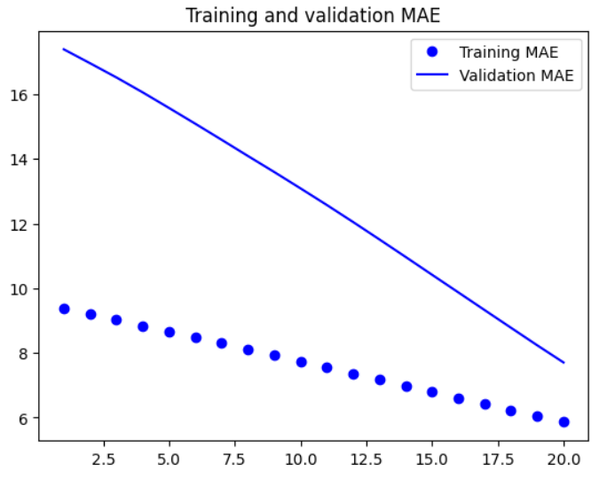

3.  **1D Convolutional Network (ConvNet):** Uses `Conv1D` layers to identify short-term patterns (motifs) in the time series data.

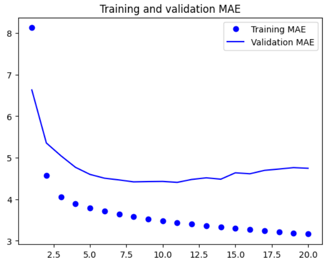
   
4.  **Simple LSTM:** A standard Long Short-Term Memory (LSTM) network, which is a type of Recurrent Neural Network (RNN) designed to learn from sequential data.

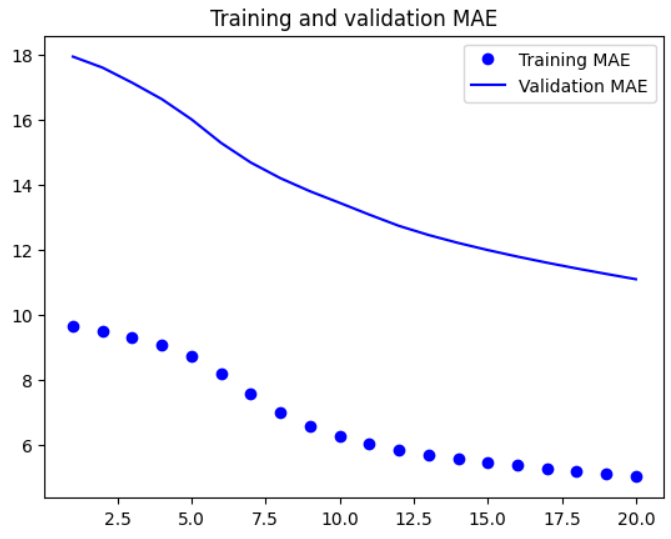

5.  **Regularized LSTM with Dropout:** To combat overfitting, `recurrent_dropout` and `Dropout` layers were added to the LSTM model.

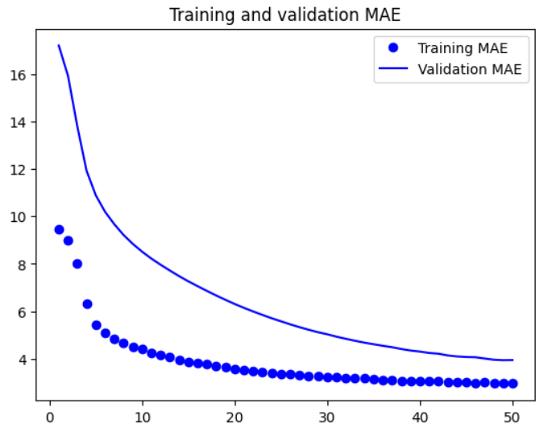

6.  **Stacked Recurrent Networks (LSTM & GRU):** Models with multiple stacked recurrent layers (both LSTM and GRU) were tested to see if deeper architectures could capture more complex patterns.

*Stacked LSTM*

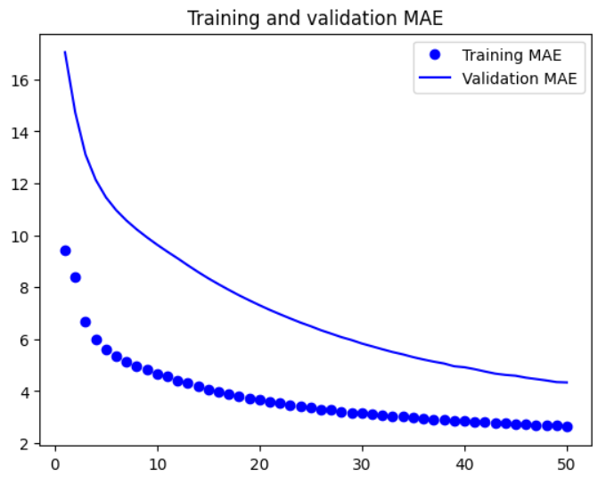

*Stacked GRU*

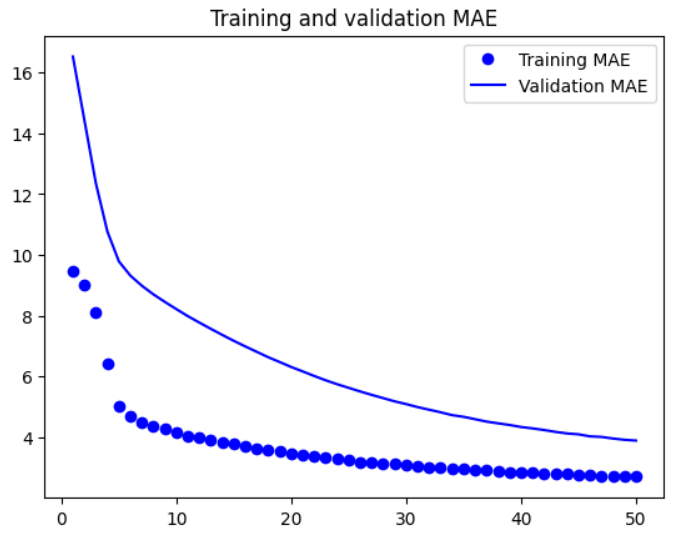

7.  **Bidirectional LSTM:** This model processes the data in both chronological and reverse-chronological order, potentially capturing patterns that might be missed by a standard unidirectional LSTM.

*Bidirectional LSTM*

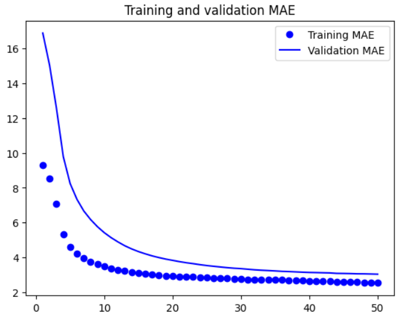

*Bidirectional LSTM v2*

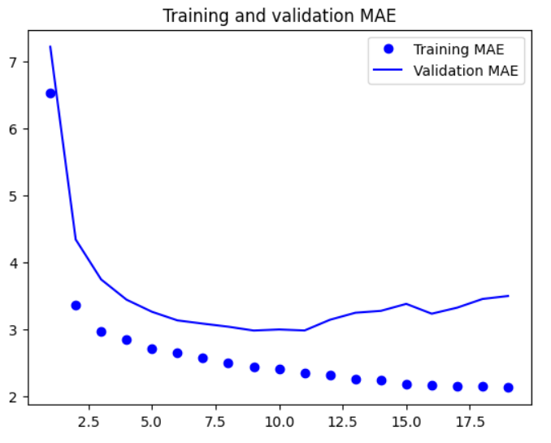

*Bidirectional LSTM + Regularizer l2*

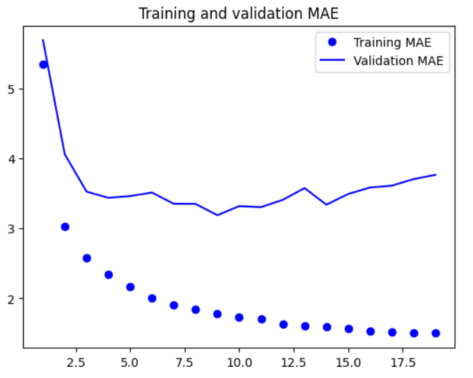

8.  **CNN + LSTM Hybrid:** A powerful architecture that first uses `Conv1D` layers to extract local features from the sequences, which are then fed into an LSTM layer to interpret the patterns over time.

*CNN + Simple RNN*

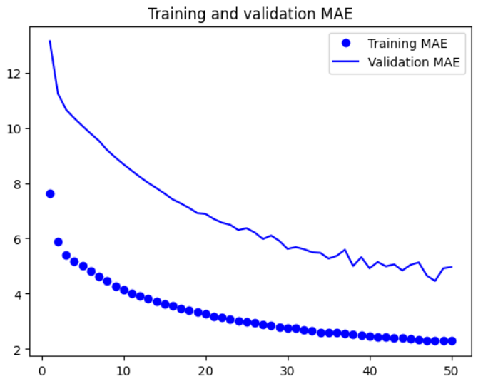

*CNN + LSTM*

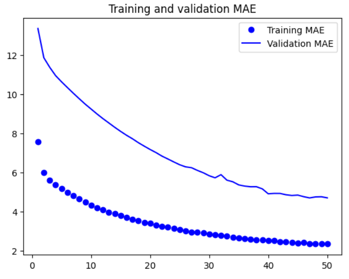

*CNN + LSTM v2*

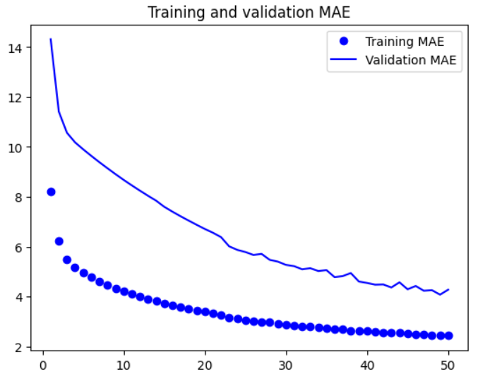

### 3. Training

All models were trained using the `AdamW` optimizer and Mean Squared Error (`mse`) as the loss function. Callbacks like `ModelCheckpoint`, `EarlyStopping`, and `ReduceLROnPlateau` were used for robust training, saving the best model, preventing overfitting, and adjusting the learning rate dynamically.

## Results

The performance of each model was evaluated on the test set. The table below summarizes the Mean Absolute Error (MAE) for each approach.

| Model                                    | Test MAE |
| ---------------------------------------- | :------: |
| **Common-sense Baseline**                | **2.15** |
| Simple Dense                             |   5.61   |
| 1D ConvNet                               |   3.94   |
| Simple LSTM                              |   3.22   |
| **Regularized LSTM with Dropout**        | **2.39** |
| Stacked LSTM with Dropout                |   2.94   |
| Stacked GRU with Dropout                 |   2.50   |
| Bidirectional LSTM with Dropout          |   3.04   |
| CNN + LSTM Hybrid with Regularization    |   3.36   |

### Key Observations

- The **Common-sense Baseline** provided a surprisingly strong benchmark, proving that simple heuristics can be effective for this dataset.
- Basic models like the **Dense Network** and **ConvNet** performed worse than the baseline, indicating that simply looking at data points without considering their temporal order is insufficient.
- The **Regularized LSTM with Dropout** was the best-performing model, achieving a Test MAE of **2.39**. This highlights the importance of regularization in preventing overfitting in recurrent networks. While it did not significantly outperform the baseline, it demonstrates the potential of RNNs for this task.
- More complex models like the stacked RNNs and the CNN+RNN hybrid did not yield better results, suggesting that for this specific problem, architectural complexity did not translate to improved performance.

## Conclusion

This notebook demonstrates a comprehensive approach to a time-series forecasting problem. The key takeaway is that while complex architectures are powerful, a well-regularized, simpler model (like a single-layer LSTM with dropout) can often be more effective. Furthermore, establishing a strong, common-sense baseline is crucial for evaluating the true performance of machine learning models.

## Installation & Usage

To replicate this project, follow the steps below.

1.  **Clone the repository:**
    ```bash
    git clone https://github.com/tomasdimeo/weather-forecast-rnn.git
    cd weather-forecast-rnn
    ```

2.  **Install dependencies:**
    It is recommended to use a virtual environment.
    ```bash
    pip install -r requirements.txt
    ```

3.  **Download the Dataset:**
    - Download the dataset from [Kaggle](https://www.kaggle.com/datasets/alistairking/weather-long-term-time-series-forecasting).

4.  **Run the Jupyter Notebook:**
    Launch Jupyter and open the `weather-long-term-time-series-forecasting.ipynb` notebook to run the cells. The notebook is configured to save the best model weights for each architecture.forecasting/` directory or update the file path in the first cell.

## Author

*   **Tomás Di Meo**
*   **LinkedIn**: `https://www.linkedin.com/in/tom%C3%A1s-di-meo-b2689a139/`
*   **GitHub**: `https://github.com/tomasdimeo`
